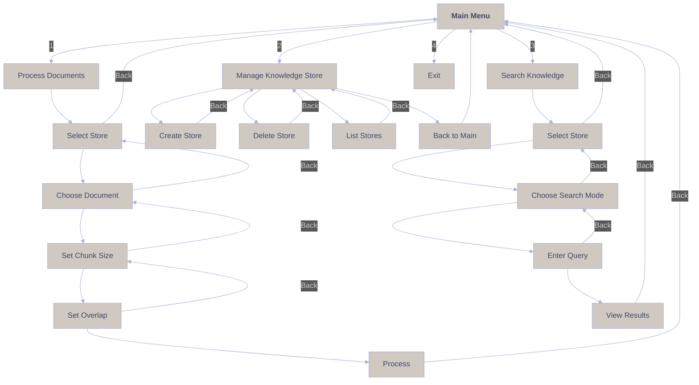

# LightRAG CLI Development Guide

## Table of Contents
1. [Project Objective](#1-project-objective)
   - [1.1 Overview](#11-overview)
   - [1.2 Key Goals](#12-key-goals)
   - [1.3 Core Processing Chain](#13-core-processing-chain)
2. [Pre-Development Analysis](#2-pre-development-analysis)
   - [2.1 Core Processing Chain to Preserve](#21-core-processing-chain-to-preserve)
3. [LightRAG CLI Documentation](#3-lightrag-cli-documentation)
   - [3.1 Overview](#31-overview)
   - [3.2 Installation](#32-installation)

## 1. Project Objective

### 1.1 Overview
Transform LightRAG from a web application into a focused command-line interface (CLI) application, creating a clean, well-structured project.

LightRAG is an advanced academic research framework that seamlessly integrates knowledge graph (KG) architectures with retrieval-augmented generation (RAG) techniques to facilitate comprehensive analysis and synthesis of scholarly literature. The system employs a robust pipeline for processing academic papers, which includes automated PDF text extraction using Marker, DOI and arXiv identification via pdf2doi, and metadata enrichment through CrossRef and arXiv APIs. Leveraging Anystyle for precise reference extraction and specialized modules for equation metadata processing, LightRAG constructs a highly interconnected semantic knowledge graph. This graph serves as the backbone for sophisticated query answering and context-aware content generation, enabling the extraction and utilization of intricate relationships and entities within the academic domain.

The architecture of LightRAG is modular and agent-driven, featuring an agentic system composed of multiple autonomous agents that collaboratively interact with the KG-RAG infrastructure to produce coherent and contextually relevant academic content. These agents are designed to perform specialized tasks such as literature synthesis, hypothesis generation, and draft composition by leveraging the interconnected knowledge embedded within the graph. The CLI-based interface, developed with Typer and questionary and enhanced with rich console outputs for improved user experience, ensures efficient state management and caching mechanisms to optimize retrieval performance and resource utilization. By facilitating seamless integration into academic workflows, LightRAG empowers researchers to streamline the paper-writing process, enhance knowledge discovery, and generate insightful responses to complex research queries through its scalable and maintainable framework.

### 1.2 Key Goals
1. **Core Functionality**: Preserve essential academic paper processing:
   - PDF text extraction (Marker)
   - DOI/arXiv identification (pdf2doi)
   - Metadata fetching (CrossRef/arXiv APIs)
   - Reference extraction (Anystyle)
   - Equation metadata processing
   - Knowledge graph capabilities

2. **Architecture**:
   - Simplify state management
   - Implement clear separation of concerns

3. **User Experience**:
   - Intuitive interface
   - Progress indicators for long operations
   - Clear error messages

4. **Quality**:
   - Basic test coverage to help identify issues and guide development
   - Proper error handling
   - Python best practices
   - Code maintainability

### 1.3 Core Processing Chain
```
PDF -> pdf2doi -> DOI/arXiv ID -> CrossRef/arXiv API -> Metadata -> Anystyle -> Raw References
```
This chain must be preserved exactly as it works in the tests.
Remember Anystyle is a gem not python package, it is installed and working as you have seen running the tests.


## 2. Pre-Development Analysis

### 2.1 Core Processing Chain to Preserve
```
PDF -> pdf2doi -> DOI/arXiv ID -> CrossRef/arXiv API -> Metadata -> Anystyle -> Raw References
```

## 3. LightRAG CLI Documentation

### 3.1 Overview

LightRAG CLI is a command-line interface for the LightRAG framework, providing an interactive way to manage knowledge stores, process documents, and perform semantic searches. The CLI is built using Typer, Questionary, and Rich for a modern, user-friendly terminal experience.

### 3.2 Installation

```bash
# Install dependencies
pip install typer questionary rich lightrag

# Run the CLI
python -m cli.main
```

## Menu Structure



## Features

### 1. Document Processing
- **Location**: `cli/commands/pdf.py`
- **Features**:
  - Select target knowledge store
  - Choose PDF document from `pdfs/` directory
  - Configure chunk size (default: 1200 tokens)
  - Set chunk overlap (default: 100 tokens)
  - Process documents into knowledge store

### 2. Store Management
- **Location**: `cli/commands/store.py`
- **Features**:
  - Create new knowledge stores
  - Delete existing stores
  - List all available stores
  - Store data location: `./stores/<store_name>/`

### 3. Knowledge Search
- **Location**: `cli/commands/search.py`
- **Features**:
  - Multiple search modes:
    - `local`: Search within specific context
    - `global`: Search across entire knowledge base
    - `hybrid`: Combine local and global search
    - `mix`: Use both knowledge graph and vector search
  - Interactive query input
  - Formatted result display

## Directory Structure

```
cli/
├── __init__.py          # Package initialization
├── main.py             # Main entry point
└── commands/           # Command modules
    ├── __init__.py     # Commands package
    ├── pdf.py         # Document processing
    ├── store.py       # Store management
    └── search.py      # Search functionality
```

## Usage Examples

### 1. Creating a New Store
```bash
$ python -m cli.main
> Select action: Manage Knowledge Store
> Select action: Create new store
> Enter store name: my_documents
✓ Store created successfully
```

### 2. Processing a Document
```bash
$ python -m cli.main
> Select action: Process Documents
> Select store: my_documents
> Select document: example.pdf
> Enter chunk size: 1200
> Enter chunk overlap: 100
✓ Document processed successfully
```

### 3. Searching Knowledge
```bash
$ python -m cli.main
> Select action: Search Knowledge
> Select store: my_documents
> Select mode: hybrid
> Enter query: What are the main topics?
✓ Displaying search results...
```

## Error Handling

The CLI includes comprehensive error handling:
- Directory existence checks
- Empty store/document validations
- Exception handling for RAG operations
- User input validation

## Best Practices

1. **Document Organization**
   - Place PDF files in the `pdfs/` directory
   - Use descriptive store names
   - Regular backups of stores recommended

2. **Search Optimization**
   - Use appropriate chunk sizes for your content
   - Choose search mode based on query type
   - Consider using mix mode for complex queries

3. **Performance**
   - Monitor store sizes
   - Use appropriate chunk sizes
   - Clean up unused stores

